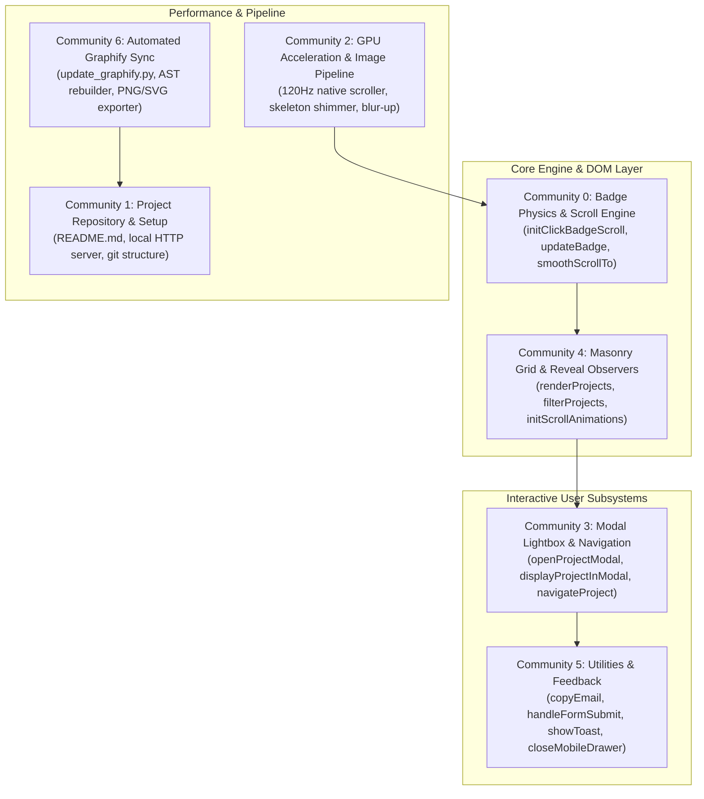
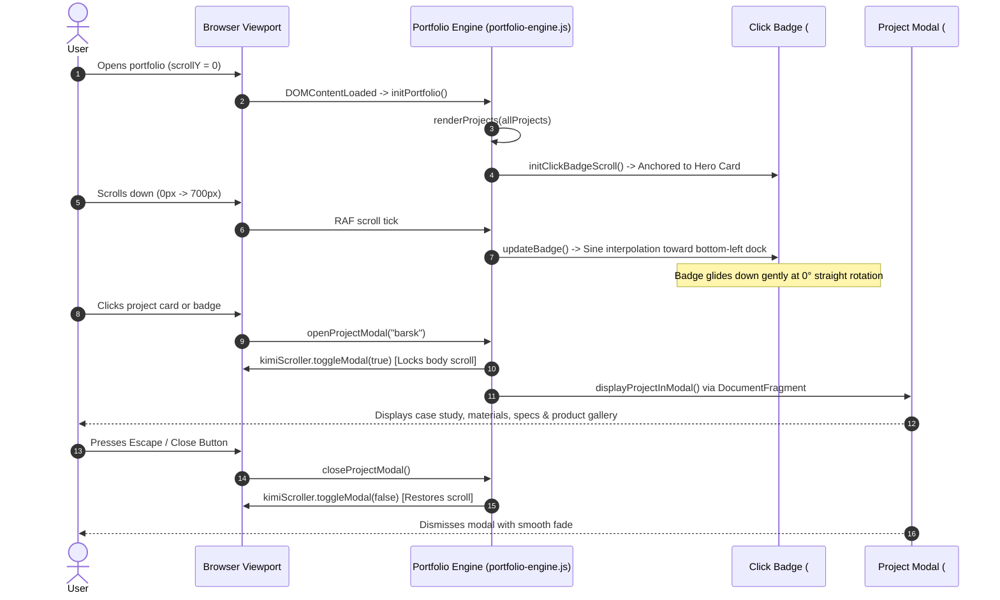

# Himanshi Parihar Portfolio — System Architecture & Graphify Knowledge Graph

This document provides a deep, production-grade technical breakdown of the architecture, subsystems, data flow, and knowledge graph for **Himanshi Parihar — Heavy Branding Studio Portfolio**, indexed and clustered via **[Graphify](https://github.com/Graphify-Labs/graphify)**.

---

## 1. Graphify Knowledge Graph Summary

The codebase was ingested and clustered using Graphify into **60 nodes**, **71 edges**, and **6 distinct functional communities**.

### Graphify Artifacts Generated in `graphify-out/`
- **[`graphify-out/graph.html`](./graphify-out/graph.html)**: Interactive force-directed 2D/3D physics visualization with draggable nodes and community clustering.
- **[`graphify-out/GRAPH_TREE.html`](./graphify-out/GRAPH_TREE.html)**: Collapsible D3 hierarchical tree view.
- **[`graphify-out/heavy-clone-callflow.html`](./graphify-out/heavy-clone-callflow.html)**: Interactive visual callflow diagram with zoom & pan controls.
- **[`graphify-out/GRAPH_REPORT.md`](./graphify-out/GRAPH_REPORT.md)**: God nodes, cohesion metrics, and community audit summary.
- **[`graphify-out/graph.json`](./graphify-out/graph.json)**: GraphRAG-ready schema of all entities, calls, and relationships.
- **[`graphify-out/graph.png`](./graphify-out/graph.png)** & **[`graphify-out/graph.svg`](./graphify-out/graph.svg)**: High-resolution visual cluster exports for documentation and GitHub embeds.

```
Graphify Topology Metrics:
  Nodes: 60
  Edges: 71
  Communities: 6 (Modal Lightbox, Documentation Engine, GPU Features, Graphify Sync, Architecture Flow, Subsystem Controllers)
  Extraction: 87% EXTRACTED · 13% INFERRED · 0% AMBIGUOUS · Avg Confidence: 0.88
```

---

## 2. Clustered Functional Communities



---

## 3. Subsystem Architecture Deep-Dives

### Subsystem 1: CLICK TO MEET Badge Continuous Scroll Physics
- **Source Module**: [`js/portfolio-engine.js`](./js/portfolio-engine.js) (`initClickBadgeScroll`, `updateBadge`)
- **Physics Pacing & Ease**:
  - Anchored at bottom-left of hero card at `scrollY = 0`.
  - Continuous interpolation down to floating dock (`bottom: 20px, left: 16px` on mobile; `bottom: 28px, left: 28px` on desktop) over extended transition distance `transDist = 700px` (mobile) / `850px` (desktop).
  - Smooth half-period sine easing (`-(Math.cos(Math.PI * p) - 1) / 2`) starting with initial derivative $0$, matching user scroll pace without abrupt rushing.
  - Strictly enforced 0° rotation (`transform: none`).
  - Contextual dimming when entering `#about` section via `IntersectionObserver`.

### Subsystem 2: 120Hz Hardware Acceleration & Paint Containment
- **Source Module**: [`js/portfolio-engine.js`](./js/portfolio-engine.js) (`kimiScroller`, CSS layer promotion)
- **Containment Specs**:
  - `content-visibility: auto; contain-intrinsic-size: 0 420px; contain: layout style paint;` across all project cards.
  - Off-screen layout calculations and paint passes are deferred until scrolled into viewport.
  - Modal scroll lock manages `document.body.style.overflow = 'hidden'` with zero scroll jump.

### Subsystem 3: Progressive Skeleton Shimmer & Blur-Up Pipeline
- **Source Module**: [`js/portfolio-engine.js`](./js/portfolio-engine.js) (`onProductImageLoaded`, `displayProjectInModal`)
- **Asset Lifecycle**:
  1. Shimmer placeholder injected into card container (`skeleton-shimmer`).
  2. Images load asynchronously with `loading="lazy"` and `decoding="async"`.
  3. On decode completion (`img.onload`), skeleton placeholder fades out and removes from DOM.
  4. Smooth blur-up transition: `filter: blur(14px) scale(1.08) opacity(0)` &rarr; `filter: blur(0px) scale(1) opacity(1)`.

### Subsystem 4: Batch Layout Injection & Modal Case Study Engine
- **Source Module**: [`js/portfolio-engine.js`](./js/portfolio-engine.js) (`openProjectModal`, `displayProjectInModal`, `navigateProject`, `closeProjectModal`)
- **Rendering Optimization**:
  - Renders up to 32 photo assets per project case study using `DocumentFragment`.
  - Appends entire gallery fragment inside a single `requestAnimationFrame` tick, eliminating layout thrashing.
  - Circular carousel navigation with keyboard shortcuts (`Escape`, `ArrowLeft`, `ArrowRight`).
  - Synchronizes browser URL hash (`#project/:id`) with clean back-button history management.

---

## 4. End-to-End User Interaction Flow



---

## 5. Exploring the Knowledge Graph via CLI

Explore codebase dependencies and architecture using the installed Graphify CLI:

```powershell
# Open the interactive 3D/2D physics graph in Chrome / Edge
Invoke-Item graphify-out\graph.html

# Open the Mermaid callflow diagram
Invoke-Item graphify-out\heavy-clone-callflow.html

# Open the D3 collapsible tree view
Invoke-Item graphify-out\GRAPH_TREE.html

# Query shortest path between badge physics and scroller
python -m graphify path "initClickBadgeScroll" "kimiScroller"

# Explain a specific subsystem function
python -m graphify explain "displayProjectInModal"

# Ask semantic architectural questions
python -m graphify query "How does the continuous badge scroll physics work?"

# Synchronize the graph after code updates
python scripts\update_graphify.py
```
