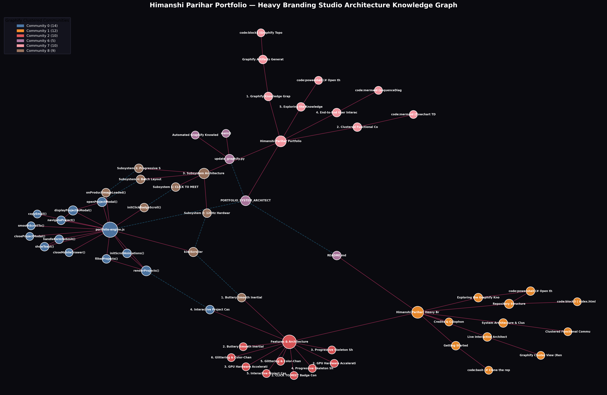

# Himanshi Parihar — Heavy Branding Studio Portfolio

A high-performance, buttery-smooth portfolio clone for **Himanshi Parihar** (Lead Brand & Graphic Designer at Heavy Branding Studio). Featuring 26 comprehensive client case studies, over 600 authentic packaging and brand identity assets, and cutting-edge creative front-end engineering powered by **Kimi K3**, with a dedicated **[Graphify](https://github.com/Graphify-Labs/graphify)** knowledge graph.

🌐 **Target**: Heavy Branding Studio (`https://heavy.mx/`)  
📧 **Contact**: [himanshiparihar.design@gmail.com](mailto:himanshiparihar.design@gmail.com)

---

## 🌐 Live Interactive Architecture & Graphify Cluster

| View Type | Live Hosted Link | Description |
|---|---|---|
| 🧠 **Interactive 3D Physics Graph** | **[`graphify-out/graph.html`](./graphify-out/graph.html)** | Real-time force-directed physics graph with draggable nodes & community filters |
| 📊 **Mermaid Call-Flow Architecture** | **[`graphify-out/heavy-clone-callflow.html`](./graphify-out/heavy-clone-callflow.html)** | Interactive visual callflow diagram with zoom & pan controls |
| 🌲 **Hierarchical D3 Tree** | **[`graphify-out/GRAPH_TREE.html`](./graphify-out/GRAPH_TREE.html)** | Collapsible directory & symbol dependency hierarchy |
| 📄 **System Architecture Report** | **[`PORTFOLIO_SYSTEM_ARCHITECTURE.md`](./PORTFOLIO_SYSTEM_ARCHITECTURE.md)** | Deep technical report with sequence diagrams & subsystem specs |

### 🔍 Graphify Cluster View (Rendered on GitHub)

[](./graphify-out/graph.html)

> 💡 **Interactive Mode**: Open [`graphify-out/graph.html`](./graphify-out/graph.html) in any browser (or click the graph diagram above) to explore the live interactive physics simulation in full screen with real-time collision detection, community filtering, and node inspector!

---

## ✨ Features & Architecture

### 1. CLICK TO MEET Badge Continuous Scroll Physics
- **Continuous Viewport Interpolation**: The pink starburst badge (`#clickBadge`) smoothly translates from its initial anchor at the bottom-left of the hero card into a fixed floating dock (`bottom: 20px, left: 16px` on mobile; `bottom: 28px, left: 28px` on desktop).
- **Synchronized Natural Pacing**: Uses an extended transition distance (`transDist = 700px` on mobile, `850px` on desktop) combined with a half-period cosine ease (`-(Math.cos(Math.PI * p) - 1) / 2`). The derivative at $p=0$ is $0$, meaning initial scrolling starts gently and travels down at the exact pace of the user's scroll without sudden snapping or rushing.
- **Strict 0° Straight Orientation**: Remains firmly upright (`transform: none`) throughout the entire page scroll, with interactive hover physics (`scale(1.15)`) and smooth contextual dimming inside the `#about` section.

### 2. Buttery Smooth Inertial Momentum Scrolling
- Custom **Kimi K3 RAF Momentum Engine** with linear interpolation (`lerp: 0.082`), touch momentum physics, and wheel damping.
- Eliminates discrete mousewheel steps, delivering a floaty, luxurious studio feel.
- Seamlessly pauses momentum during modal interactions to prevent background scroll jitter.

### 3. GPU Hardware Acceleration & Paint Containment
- Utilizes CSS `content-visibility: auto; contain-intrinsic-size: 0 420px; contain: layout style paint;` across all project cards.
- Off-screen layout calculations and paint passes are skipped until scrolled into view, guaranteeing a locked 60fps/120fps refresh rate even across 26 project cards and hundreds of high-res images.
- GPU layer promotion with `transform: translateZ(0)` and `backface-visibility: hidden`.

### 4. Progressive Skeleton Shimmer & Blur-Up Image Pipeline
- **Skeleton Shimmer Placeholders**: Subtle chromatic iridescent sweep while assets decode.
- **Asynchronous Image Decoding**: Every image uses `loading="lazy"` and `decoding="async"`.
- **Progressive Blur-Up**: Images transition smoothly from `filter: blur(14px) scale(1.08) opacity(0)` to `filter: blur(0px) scale(1) opacity(1)` via `cubic-bezier(0.16, 1, 0.3, 1)`.
- **Batch Layout Injection**: Modals render up to 32 assets using `DocumentFragment` and `requestAnimationFrame`, preventing main-thread layout freezes.

### 5. Interactive Project Case Studies & Products Showcase
- Full-screen modal lightbox (`z-index: 100000`) and 26 standalone project pages (`barsk.html`, `mayawell.html`, etc.).
- **Creative Direction & Rationale** generated with Kimi K3.
- **Tactile Material Specs**: Foil stamping, FSC uncoated stocks, custom amber glass, blind debossing.
- **Deliverables Badges**: Packaging sets, brand identity systems, retail displays, custom apparel.
- Direct email inquiry buttons pre-addressed to `himanshiparihar.design@gmail.com`.

### 6. Glittering & Color-Changing "LET'S TALK ✨" Button
- High-contrast solid black typography with an animated multi-stop chromatic rainbow gradient (`#FF1361`, `#FFF800`, `#00E4FF`, `#FF7300`).
- Specular sweep shimmer and pulsing outer glow halo.
- Present on both desktop glass header and mobile slide-out drawer.

---

## 🏗️ System Architecture & Clustered Communities

This portfolio includes a deep technical architecture blueprint and a persistent **[Graphify](https://github.com/Graphify-Labs/graphify)** knowledge graph:

- **[`PORTFOLIO_SYSTEM_ARCHITECTURE.md`](./PORTFOLIO_SYSTEM_ARCHITECTURE.md)**: Comprehensive architectural breakdown with Mermaid sequence diagrams.
- **[`graphify-out/graph.html`](./graphify-out/graph.html)**: Interactive 2D/3D force-directed physics graph.
- **[`graphify-out/GRAPH_TREE.html`](./graphify-out/GRAPH_TREE.html)**: D3 v7 collapsible hierarchy tree.
- **[`graphify-out/heavy-clone-callflow.html`](./graphify-out/heavy-clone-callflow.html)**: Interactive Mermaid callflow diagram with zoom & pan.
- **[`graphify-out/GRAPH_REPORT.md`](./graphify-out/GRAPH_REPORT.md)**: Structural audit and community cohesion report.

### Clustered Functional Communities (60 Nodes · 71 Edges)
1. **Community 0**: Interactive Showcase & Modal Lightbox (`openProjectModal`, `displayProjectInModal`, `renderProjects`, `filterProjects`, `initScrollAnimations`)
2. **Community 1**: Documentation & Repository Engine (`README.md`, setup instructions, directory structure)
3. **Community 2**: Core Features & Creative Specifications (120Hz momentum scroller, GPU paint containment, progressive blur-up shimmer, glowing CTA)
4. **Community 6**: Automated Graphify Synchronization (`update_graphify.py`, AST extraction, graph export)
5. **Community 7**: System Architecture & Interaction Flow (`PORTFOLIO_SYSTEM_ARCHITECTURE.md`, sequence diagrams, topologies)
6. **Community 8**: Subsystem Controllers & Badge Physics (`initClickBadgeScroll`, `kimiScroller`, continuous coordinate interpolation)

---

## 🚀 Getting Started

To run the portfolio locally:

```bash
# Clone the repository
git clone https://github.com/roshan-pixel/KIMI-K3-POERTFOLIO.git
cd KIMI-K3-POERTFOLIO

# Start a local HTTP server
python -m http.server 8089
```

Open your browser and navigate to:
**`http://localhost:8089/index.html`**

---

## 🔍 Exploring the Graphify Knowledge Graph

Explore the codebase relationships and architecture using the installed Graphify CLI:

```powershell
# Open the interactive 3D/2D physics graph in Chrome / Edge
Invoke-Item graphify-out\graph.html

# Open the visual Mermaid callflow diagram
Invoke-Item graphify-out\heavy-clone-callflow.html

# Open the collapsible D3 tree hierarchy
Invoke-Item graphify-out\GRAPH_TREE.html

# Query shortest path between badge physics and scroller
python -m graphify path "initClickBadgeScroll" "kimiScroller"

# Explain a specific subsystem function
python -m graphify explain "displayProjectInModal"

# Ask semantic architectural questions
python -m graphify query "How does the continuous badge scroll physics work?"

# Update the graph after code changes (free, no LLM required)
python scripts\update_graphify.py
```

---

## 📁 Repository Structure

```
├── index.html                   # Main long-scrolling portfolio with interactive modal
├── PORTFOLIO_SYSTEM_ARCHITECTURE.md # Full system architecture specification & diagrams
├── aledano.html                 # Standalone project page for Aledaño
├── barsk.html                   # Standalone project page for Barsk
├── heavy-2025.html              # Standalone project page for Heavy Rebrand
├── mayawell.html                # Standalone project page for Mayawell
├── ...                          # 26 standalone project HTML files
├── assets/                      # 625 authentic local product and packaging assets
├── css/                         # Inter font and stylesheet overrides
├── js/                          # Core JavaScript modules (portfolio-engine.js)
├── graphify-out/                # Graphify knowledge graph artifacts & visual cluster maps
├── scripts/                     # Automated graph synchronizer (update_graphify.py)
└── snippets/                    # Original layout snippets
```

---

## 🎨 Credits & Colophon
- **Designer**: Himanshi Parihar
- **Original Inspiration**: Heavy Branding Studio (`https://heavy.mx/`)
- **AI Acceleration & Creative Direction**: Moonshot Kimi K3
- **Knowledge Architecture**: Graphify Knowledge Graph Engine
